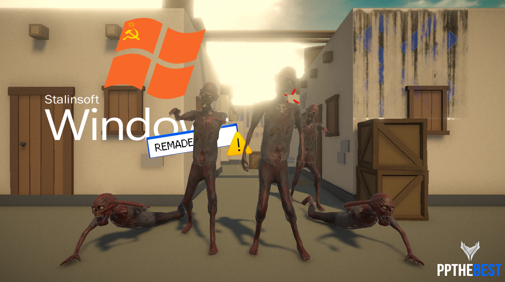

<div align="center">
  
  
  # Windows Soviet Edition (Remake)

  **Submission for CRUx Inductions Round 1**
</div>

This project is a remake of **Windows Soviet Edition**, a mock OS game I originally created in August 2020. This repository serves as a replication of v0.1 (the original version) of the game.
>The game has a few easter eggs. See if you can find 'em all (heh)

## History

I originally made this project back in 2020 as a breather from my usual work, which focused heavily on the horror genre. It was heavily inspired by a mock animated video by [INFRA TV_CZ](https://www.youtube.com/watch?v=yZ6c17SLB7E).

Unexpectedly, the project went viral:
* **130k+ views** on the [original gameplay video](https://www.youtube.com/watch?v=QimObXHr8rQ).
* **~24,000 downloads** on the [original build](https://realpratz.itch.io/winsov).
* Featured in multiple Let's Play videos by YouTubers (e.g., [this one](https://youtu.be/zKabNmTi9FE?si=P3ksNu-HpZeJpMCJ)).

Being the niche and goofy project it is, I decided to remake this project for the CRUx inductions to revisit the fun I had developing it 6 years ago.

## How to Run

1.  Clone the repository:
    ```bash
    git clone https://github.com/realpratz/winsov.git
    ```
2.  Open **Unity Hub**.
3.  Add the project to your list ensuring you are using Unity version **6000.0.61f1** (Unity 6).
4.  Open the project and load the AMI scene from the `Assets/Scenes` folder.
5.  Press **Play** in the editor to start the OS simulation.

> Alternatively, you can download the ```.unitypackage``` from [itch.io](https://realpratz.itch.io/winsov). Just double-click and it will open itself in the unity project itself.

## How to Play

You can play the game on Windows by downloading v0.3 (remake) from [itch.io](https://realpratz.itch.io/winsov).

1. Double click on the setup file and follow through the instructions.
2. Enjoy!

## Credits

This game uses models from the Unity Asset Store and the Internet:
1. [JustCreate](https://assetstore.unity.com/publishers/44390)
2. [Pxltiger](https://assetstore.unity.com/publishers/11247)
3. [Wittybacon](https://sketchfab.com/wittybacon)

This game uses sounds/music the Internet (original and modified):
1. [Dschinghis Khan](https://www.youtube.com/channel/UCsr3YYPk4A2rG6V88CwWTFA)
2. Red Alert 3
3. various other sources

All sprites used in the game are from the Internet (original and modified) or self designed.

All code was self written.

Project written in C# using Universal Render Pipeline (URP) of Unity 6000.0.61f1.
